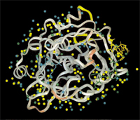

# WatCH

WatCH is a tool for the calculation of conserved water sites in a series of related structures in [Protein Data Bank] files. WatCH was developed by members of the [Protein Structural Analysis and Design Laboratory](http://www.kuhnlab.bmb.msu.edu) at Michigan State University. When several structures are superimposed, complete linkage cluster analysis provides an objective technique for resolving the continuum of overlaps between water sites into the set of maximally dense microclusters of overlapping water molecules, and also avoids reliance on any one structure as a reference.

## Relevant Publications

Relevant publications related to WatCH include the following:

- P. C. Sanschagrin and L. A. Kuhn (1998) Cluster Analysis of Consensus Water Sites in Thrombin and Trypsin Shows Conservation Between Serine Proteases and Contributions to Ligand Specificity, Protein Science, 7, 2054-2064. [Link to PDF](http://www.kuhnlab.bmb.msu.edu/publication_papers/pdf/kuhn1998.pdf)

## Installation

**Installation and Use of WatCH implies agreement with the [License Agreement](licence.txt).**

**System Requirements:** WatCH has been compiled with the GNU and Sun C compiler packages on Sun Solaris for SPARC and x86 and IRIX platforms, but should work with most C compilers. Accessory installation, data extraction, and results analysis scripts also require perl, but the clustering program itself will run without it.

The latest version of WatCH, as well as the most recent version of this documentation, can be downloaded below. To install WatCH, perform the following steps:

To install WatCH, perform the following steps:

- Download WatCH from this repository.
- Place this file in the directory into which you wish to install the software and unzip it.
- Check that your perl installation is accessible via `/bin/perl`. This can be done by typing `/bin/perl -v`, which will result in version and copyright information output. If this does not work, edit the `install.pl` script to point to the correct perl executable. This can be identified by typing "which perl" at the command line prompt.
- Run `./install.pl`

(This assumes you have perl. If not, change to the src directory, type make, and then move cluster (the binary program) to your desired installation or bin directory.)

- WatCH will now be compiled using the file locations specified.

- To run WatCH, type "WatCH" at the command prompt.

## Running WatCH

### Usage Overview

Before WatCH is run, the input PDB structures must be prepared as described below in the "Coordinate File Preparation" section. WatCH is run via the command-line interface with the following usage:

    Usage: cluster <point file> [<clustering threshold>] [<output file>]

(if threshold is not given, 2.40 will be used)
(for the output file option to be used, the threshold must be set explicitly)
(point file must in form of <integer label> <X> <Y> <Z>)

It requires an input file of the following form:

    # WaterID X     Y       Z
    10934     9.123 -10.345  11.653

Where:

- WaterID: an unique identifier for each water molecule consisting of an integer structure ID number concatenated with the water molecule's residue number. This file should contain all of the water molecules to be analyzed.

- X, Y, and Z: Coordinates of the water molecule.

Generation of this file is described below in *Coordinate File Preparation*.

The resulting output file is in the following form:

    # Column Number
    #1       2     3       4       5        6
    0        7    4.889 -24.226  27.970  -- 100305 100324 100346 100434 100307 100339 100312
    1        6   -0.668  -7.894  25.561  -- 100306 100309 100388 100459 100499 100506
    2        4   18.532 -13.080  32.383  -- 100308 100315 100311 100314

Where the columns are:

1. Cluster Number,
2. Cluster Conservation (i.e. number of water molecules in that cluster),
3. X coordinate of the cluster,
4. Y coordinate of the cluster,
5. Z coordinate of the cluster, and
6. Cluster contents (i.e. which water molecules are in that cluster).

### Coordinate File Preparation

Running WatCH requires the extraction of coordinates of the water molecules in each of the crystallographic structures of interest to a file as described above.

1. Superimpose each of the structures in question to a common reference frame. This can be done using InsightII's Transform/Superimpose command or via another superposition method.

2. Extract the WaterID and coordinate information for water molecules in each of the structures of interest using the prep_WatCH script. This must be run for each superimposed structure, giving each structure a unique identifier. This script is run as follows:

  - First Structure:
    - `prep_WatCH <structure ID> <pdb file> > <output file>`
  - Subsequent Structures:
    - `prep_WatCH <structure ID> <pdb file> >> <output file>`

### Results Analysis

As described above, the output of WatCH is a file in which contains the coordinates for each cluster, calculated as the mean of the coordinates of each of the cluster's member water molecules, and the cluster contents, i.e. the identifiers for the water molecules which are a member of that cluster. There are 3 additional perl scripts that may be of use for analysis of the results.

**Usage:**

    check_cluster_contents.pl  <check> <cluster file>

    where checks are:

    -d (find clusters with waters from same structure)
    -c (give count of points from each str in each cluster)
    -p <point id> (find cluster with specified cluster point)
    -s <structure id> (find clusters from a specific structure)
    except for -d and -c together, only 1 check may be used

- `cluster2pdb.pl:`

Convert the cluster output file to a PDB formatted file, containing water molecules representing each cluster centroid. The B-value column is used to hold the degree of conservation for each cluster.

- `cluster2percent.pl:`

Convert the cluster output file from one with absolute degrees of conservation, e.g. the cluster is conserved in 4 structures (of the e.g. 8), to one with relative conservation, e.g. the cluster is conserved in 50% of the structures. This script, followed by cluster2pdb.pl, can be used to achieve a PDB formatted file of the cluster cetntroids with the B-value column containing percentage conservation.

An additional file is provided, an *InsightII* (Accelrys, Inc) spectrum, which can be used to facilitate coloring of the cluster output by degree of conservation, after using `cluster2percent.pl` and `cluster2pdb.pl`. This file is misc/cluster_per.spect and can be read using the InsightII Spectrum/Get command. The spectrum is colored with dark blue as 0% conservation, purplish blue as 50% conservation, purplish red as just over 50% conservation, and dark red as 100% conservation.

## Demonstration Files

Included in the demo directory are a series of files which can be used as a demonstration of WatCH. This demo uses three thrombin structures, PDB codes 1hai, 1hah, and 1vr1.

#### 1)

Superimpose 1hah and 1vr1 onto 1hai using the catalytic triad residues (His H57, Asp H102, & Ser H195). This gives the following files: `1hai.pdb` 

(untransformed as it was used as the base for superposition), `1hah.transformed.pdb`, and `1vr1.transformed.pdb`.

#### 2)

Extract the water molecule data from each file:

    ../bin/prep_WatCH 10 1hai.pdb > 1hai.wats
    ../bin/prep_WatCH 20 1hah.transformed.pdb > 1hah.wats
    ../bin/prep_WatCH 30 1vr1.transformed.pdb > 1vr1.wats

#### 3)

Cat the files together into a single input file:

    cat 1hai.wats 1hah.wats 1vr1.wats > all.wats

#### 4)

Run the clustering program:

    ../bin/cluster all.wats 2.4 all.clusters

#### 5)

    ../bin/cluster2percent.pl 3 all.clusters > all.clusters.percent

#### 6)

Transform the cluster files into PDB files for visualization with InsightII, RasMol, or another molecular visualization program:

    ../bin/clusters2pdb.pl all.clusters > all.clusters.pdb
    ../bin/clusters2pdb.pl all.clusters.percent > all.clusters.percent.pdb

#### 7)

    ../bin/check_cluster_contents.pl -d all.clusters > all.clusters.samestr

#### 8)

Count the number of water molecules from each structure in each cluster:

    ../bin/check_cluster_contents.pl -c all.clusters > all.clusters.strcount

#### 9)

Identify the cluster which contains water molecule number 431 from 1hai (structure ID 10; water ID 100431):

    ../bin/check_cluster_contents.pl -p 100431 all.clusters all.clusters.point100431

#### 10) 

Identify clusters which contain water molecules from 1vr1 (structure ID 30):

## Algorithmic Details

WatCH uses complete-linkage hierarchical cluster analysis to calculate clusters of bound water molecules. Details of this algorithm and its application to thrombin and trypsin can be found in the following reference:

- P. C. Sanschagrin and L. A. Kuhn (1998), "Cluster Analysis of Consensus Water Sites in Thrombin and Trypsin Shows Conservation between Serine Proteases and Contributions to Ligand Specificity" [Link to PDF](http://www.kuhnlab.bmb.msu.edu/publication_papers/pdf/kuhn1998.pdf) Prot. Sci., Vol. 7, No. 10, October 1998, pp 2054-2064.

## More Information

More Information
Scientific inquries concerning WatCH should be directed to Leslie Kuhn at: kuhnlab@msu.edu
